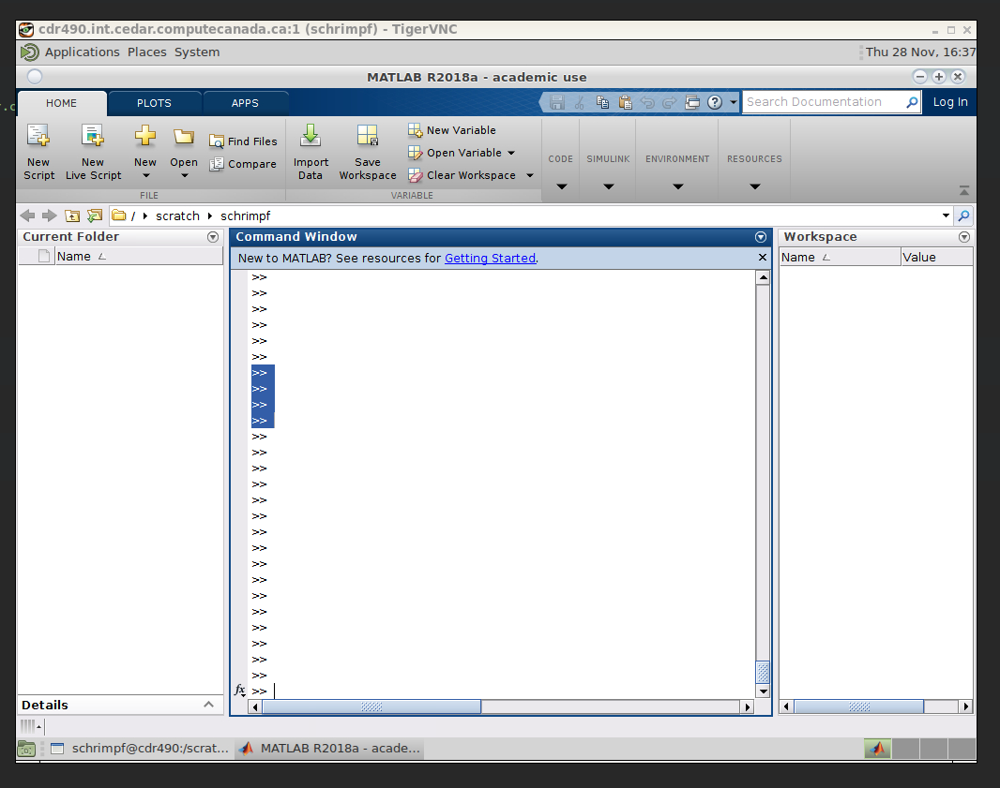

# VNC session on Compute Canada

[Instructions from Compute Canada.](https://docs.computecanada.ca/wiki/VNC)

Here are instructions for running a VNC session on
cedar.computecanada.ca.

While running, the VNC session should give a similar experience to
`turtle.econ.ubc.ca`. An important difference though is that while
turtle allows users to have persistent VNC sessions, on Compute Canada
you have to start a new VNC session each time you use it. While slightly
less convenient, this ensures that there aren't a
bunch of idle VNC sessions and programs in them using up memory (a
common situation on `turtle.econ.ubc.ca`). 

1. ssh to a Compute Canada server

```console
paul@pts2 ~ $ ssh schrimpf@cedar.computecanada.ca
Last login: Thu Nov 28 16:03:16 2019 from 137.82.185.90
=============================================================================
Welcome to Cedar!

For information see: https://docs.computecanada.ca/wiki/Cedar
Email support@computecanada.ca for assistance and/or to report problems.
=============================================================================
```

2. Enter your /scratch or /project directory

```console
[schrimpf@cedar1 ~]$ cd /scratch/schrimpf
```

3. Submit an interactive job request
```console
[schrimpf@cedar1 schrimpf]$ salloc --time 5:0:0 --ntasks=1 --cpus-per-task=2 --mem=4Gb
salloc: Granted job allocation 31922474
salloc: Waiting for resource configuration
salloc: Nodes cdr490 are ready for job
[schrimpf@cdr490 schrimpf]$
```
  This asks for a 5 hour session on 1 node with 2 cores and 4Gb
  memory. In my limited experimentation, smallish requests like this
  have always been fulfilled within seconds. For large requests you
  might have to wait, but I have no idea what qualifies as "large." 

4. Set XDG\_RUNTIME . You will have strange errors inside vnc
   otherwise.
   
```console
[schrimpf@cdr490 schrimpf]$ export XDG_RUNTIME_DIR=${SLURM_TMPDIR}
```


5. Start VNC. It will prompt for a password on first use. 

```console
[schrimpf@cdr490 schrimpf]$ vncserver
New 'cdr490.int.cedar.computecanada.ca:1 (schrimpf)' desktop is cdr490.int.cedar.computecanada.ca:1

Starting applications specified in /home/schrimpf/.vnc/xstartup
Log file is /home/schrimpf/.vnc/cdr490.int.cedar.computecanada.ca:1.log
```

6. Open another ssh session with an appropriate tunnel. You need the
   `cdr490` and `1` from `cdr490.int.cedar.computecanada.ca:1`. I
   think, that you also need to keep your initial ssh connection
   active. You want to connect port 5900 + 1 
   (or whatever number you were given instead of `1`) from `cdr490`
   (this will also differ depending on what node you were allocated)
   to a local port 590X (5901 is a typical choice, but I will use 5902
   below so as not to confuse with the remote 5901)

```console
paul@pts2 ~ $ ssh schrimpf@cedar.computecanada.ca -L5902:cdr490:5901
```

7. Open a vnc client to your chosen display X or port 590X. 

```console
paul@pts2 ~ $ vncviewer :2
```

8. In your VNC session, load modules and run whatever program you need.




It would be helpful if someone were to write a script to automate
these steps. 


